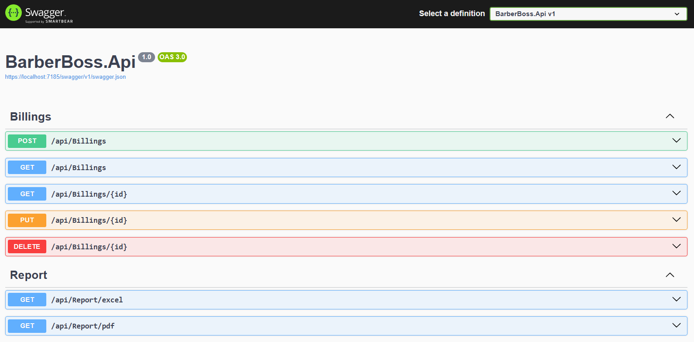
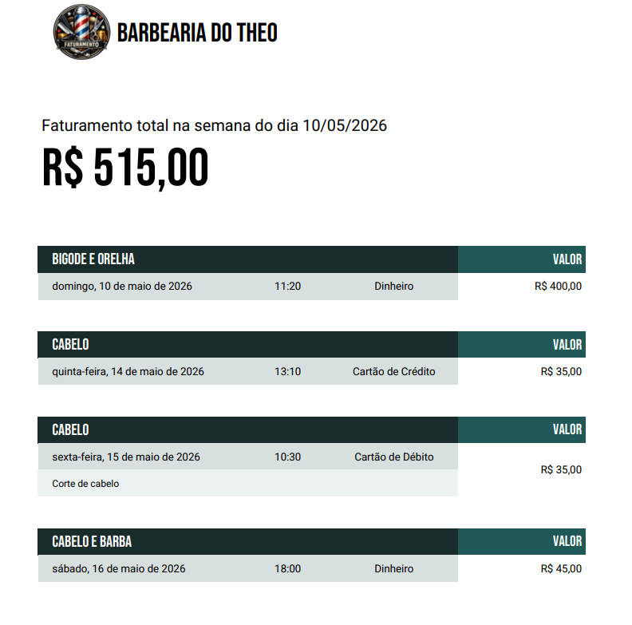
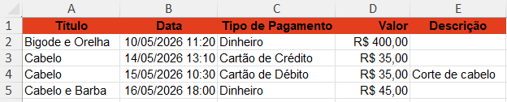

# 💈 BarberBoss API

API REST para gerenciamento de faturamento de barbearias, desenvolvida com **ASP.NET Core**, **MySQL** e documentada com **Swagger**. Permite criar, visualizar, editar e excluir registros de faturamento, além de exportar relatórios semanais em **PDF** e **Excel**.

Projeto desenvolvido como desafio prático da trilha de **C# / .NET** da [Rocketseat](https://app.rocketseat.com.br).

---

## 📸 Preview

### Documentação Swagger


### Relatório PDF


### Relatório Excel


---

## 🚀 Tecnologias

- [.NET 8](https://dotnet.microsoft.com/)
- [ASP.NET Core](https://learn.microsoft.com/aspnet/core)
- [Entity Framework Core](https://learn.microsoft.com/ef/core)
- [MySQL](https://www.mysql.com/)
- [Swagger / Swashbuckle](https://swagger.io/)
- [xUnit](https://xunit.net/) — Testes de unidade
- [QuestPDF](https://www.questpdf.com/) — Geração de PDF
- [ClosedXML](https://github.com/ClosedXML/ClosedXML) — Geração de Excel

---

## ✅ Funcionalidades

- [x] Criar um faturamento
- [x] Listar todos os faturamentos
- [x] Buscar faturamento por ID
- [x] Editar um faturamento
- [x] Excluir um faturamento
- [x] Exportar relatório semanal em **PDF**
- [x] Exportar relatório semanal em **Excel**
- [x] Tratamento global de erros e filtros de exceções
- [x] Testes de unidade
- [x] Documentação via Swagger

---

## 📋 Endpoints

### Billings

| Método     | Endpoint              | Descrição                            | Status Code |
|------------|-----------------------|--------------------------------------|-------------|
| `POST`     | `/api/Billings`       | Criar um novo faturamento            | `201`       |
| `GET`      | `/api/Billings`       | Listar todos os faturamentos         | `200`       |
| `GET`      | `/api/Billings/{id}`  | Buscar faturamento por ID            | `200`       |
| `PUT`      | `/api/Billings/{id}`  | Atualizar um faturamento             | `204`       |
| `DELETE`   | `/api/Billings/{id}`  | Excluir um faturamento               | `204`       |

### Reports

| Método | Endpoint           | Descrição                                        | Status Code |
|--------|--------------------|--------------------------------------------------|-------------|
| `GET`  | `/api/Report/pdf`  | Gerar relatório semanal em PDF (por data)        | `200`       |
| `GET`  | `/api/Report/excel`| Gerar relatório semanal em Excel (por data)      | `200`       |

> **Parâmetro de filtro dos relatórios:** `?date=2026-05-10`
> A API filtra automaticamente a **semana completa** referente à data informada.

---

## 🗂️ Estrutura do Projeto

```
API_BarberBoss/
├── src/
|   ├── BarberBoss.Api/              # Controllers, filtros, configuração
|   ├── BarberBoss.Application/      # Use Cases, DTOs, validações
|   ├── BarberBoss.Communication/    # Requests e Responses da API
|   ├── BarberBoss.Domain/           # Entidades e enums
|   ├── BarberBoss.Exception/        # Exceções customizadas e filtros de erro
|   └── BarberBoss.Infrastructure/   # EF Core, MySQL, repositórios
└── tests/
    └── BarberBoss.Tests/            # Testes de unidade (xUnit)
```

---

## ⚙️ Como Rodar o Projeto

### Pré-requisitos

- [.NET 8 SDK](https://dotnet.microsoft.com/download)
- [MySQL](https://dev.mysql.com/downloads/) (local ou via Docker)
- [Git](https://git-scm.com/)

### 1. Clone o repositório

```bash
git clone https://github.com/TheoRondon25/API_BarberBoss.git
cd API_BarberBoss
```

### 2. Configure a string de conexão

No arquivo `src/BarberBoss.Api/appsettings.json` (ou `appsettings.Development.json`), ajuste a connection string com seus dados do MySQL:

```json
{
  "ConnectionStrings": {
    "DefaultConnection": "Server=localhost;Database=barberboss;Uid=root;Pwd=suasenha;"
  }
}
```

### 3. Aplique as migrations

```bash
dotnet ef database update --project src/BarberBoss.Infrastructure --startup-project src/BarberBoss.Api
```

### 4. Rode a aplicação

```bash
dotnet run --project src/BarberBoss.Api
```

A API estará disponível em `https://localhost:7185`.

### 5. Acesse o Swagger

```
https://localhost:7185/swagger
```

---

## 🧪 Rodando os Testes

```bash
dotnet test
```

Os testes cobrem as regras de negócio, cálculo de totais e validações dos use cases.

---

## 📊 Gerando os Relatórios

Os relatórios são filtrados por **semana** com base em uma data informada.

### Relatório em PDF

```
GET /api/Report/pdf?date=2026-05-10
```

Retorna um arquivo `.pdf` com todos os faturamentos da semana que contém a data `10/05/2026` (de segunda a domingo, ou domingo a sábado conforme configurado).

### Relatório em Excel

```
GET /api/Report/excel?date=2026-05-10
```

Retorna um arquivo `.xlsx` com os faturamentos da mesma semana, formatado com as colunas: **Título**, **Data**, **Tipo de Pagamento**, **Valor** e **Descrição**.

> 💡 **Dica:** Você pode testar diretamente pelo Swagger, clicando em *"Try it out"* no endpoint desejado e informando a data no campo `date`.

---

## 📐 Modelo de Dados

| Campo           | Tipo       | Obrigatório | Observações                                  |
|-----------------|------------|-------------|----------------------------------------------|
| `id`            | GUID       | Sim         | Gerado automaticamente                       |
| `date`          | DateOnly   | Sim         | Data do faturamento                          |
| `barberName`    | string     | Sim         | 2–80 caracteres                              |
| `clientName`    | string     | Sim         | 2–120 caracteres                             |
| `serviceName`   | string     | Sim         | 2–120 caracteres (ex: corte, barba, combo)   |
| `amount`        | decimal    | Sim         | Valor ≥ 0; se cancelado, deve ser 0          |
| `paymentMethod` | enum       | Sim         | `Dinheiro`, `Cartão de Crédito`, `Cartão de Débito`, `Pix`, `Outro` |
| `status`        | enum       | Sim         | `Pago`, `Cancelado`, `Pendente`              |
| `notes`         | string     | Não         | Até 500 caracteres                           |
| `createdAt`     | DateTime   | Sim         | Preenchido automaticamente na criação        |
| `updatedAt`     | DateTime   | Sim         | Atualizado a cada alteração                  |

> ⚠️ Faturamentos com status `Cancelado` **não** são somados no total do período.

---

## 🔒 Status Codes

| Código | Situação                                    |
|--------|---------------------------------------------|
| `200`  | Consultas e atualizações bem-sucedidas      |
| `201`  | Recurso criado com sucesso                  |
| `204`  | Operação concluída sem conteúdo de retorno  |
| `400`  | Dados inválidos ou campos obrigatórios      |
| `404`  | Recurso não encontrado                      |
| `409`  | Conflito de dados                           |
| `500`  | Erro inesperado no servidor                 |

---

## 🧠 Aprendizados

Durante o desenvolvimento deste projeto foram praticados:

- Arquitetura em camadas (API, Application, Domain, Infrastructure)
- Injeção de dependência com Entity Framework Core e MySQL
- Criação e aplicação de migrations
- Geração de relatórios com QuestPDF e ClosedXML
- Tratamento global de erros com filtros de exceção
- Testes de unidade com xUnit
- Documentação de API com Swagger (OAS 3.0)

---

## 📄 Licença

Este projeto está sob a licença MIT. Veja o arquivo [LICENSE](./LICENSE) para mais detalhes.

---

Feito durante a trilha de C# da [Rocketseat](https://rocketseat.com.br) por [Theo Rondon](https://github.com/TheoRondon25)
